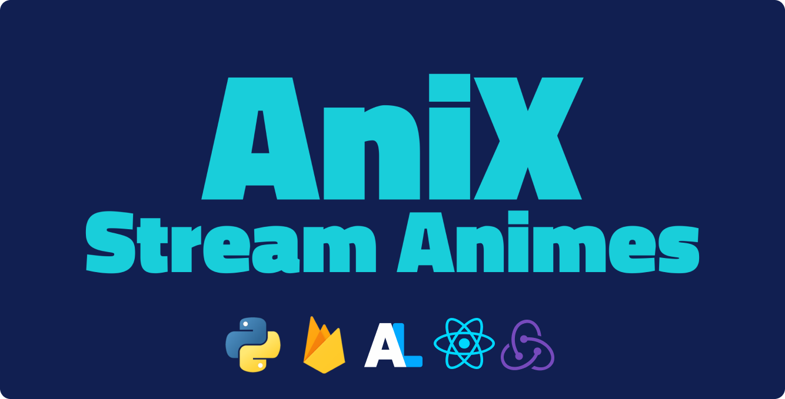
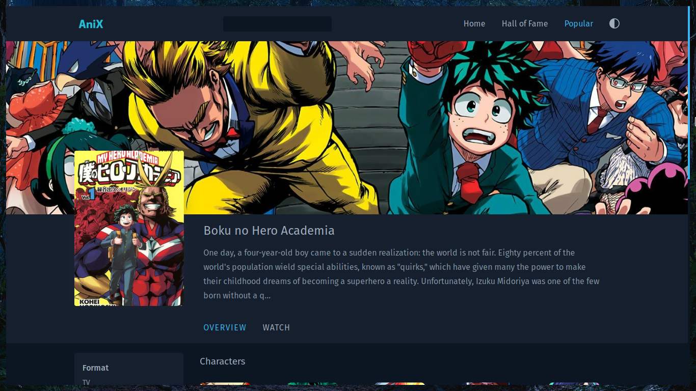
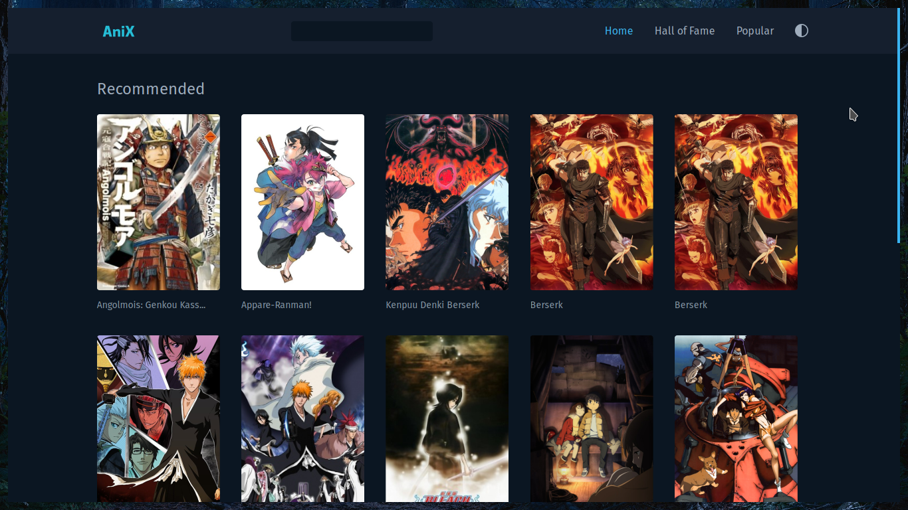
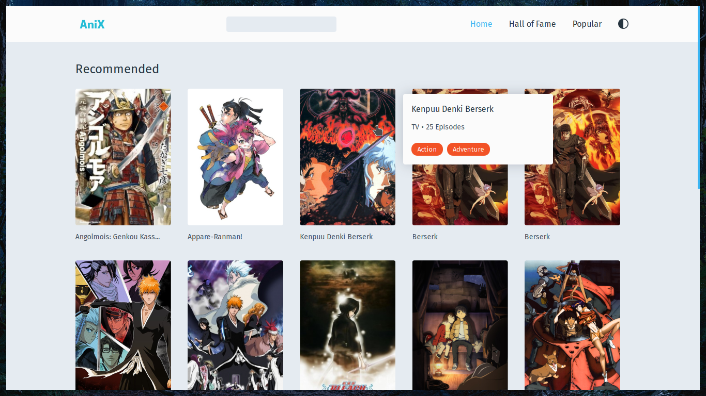
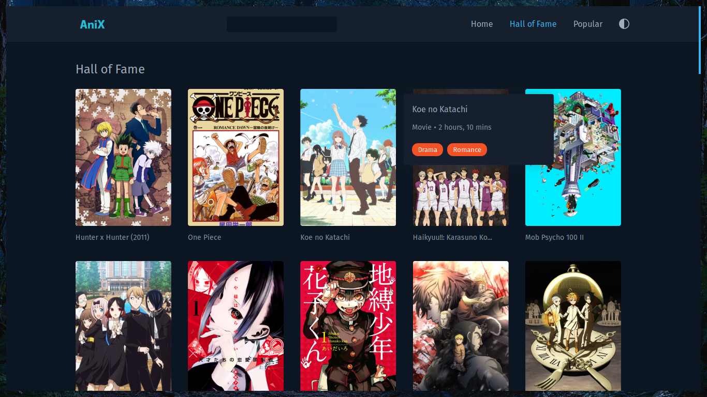
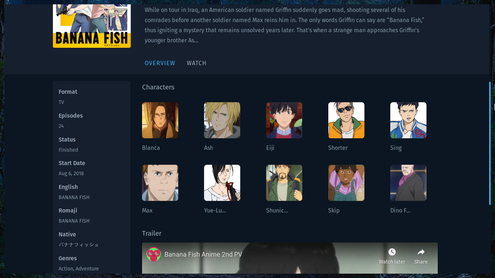
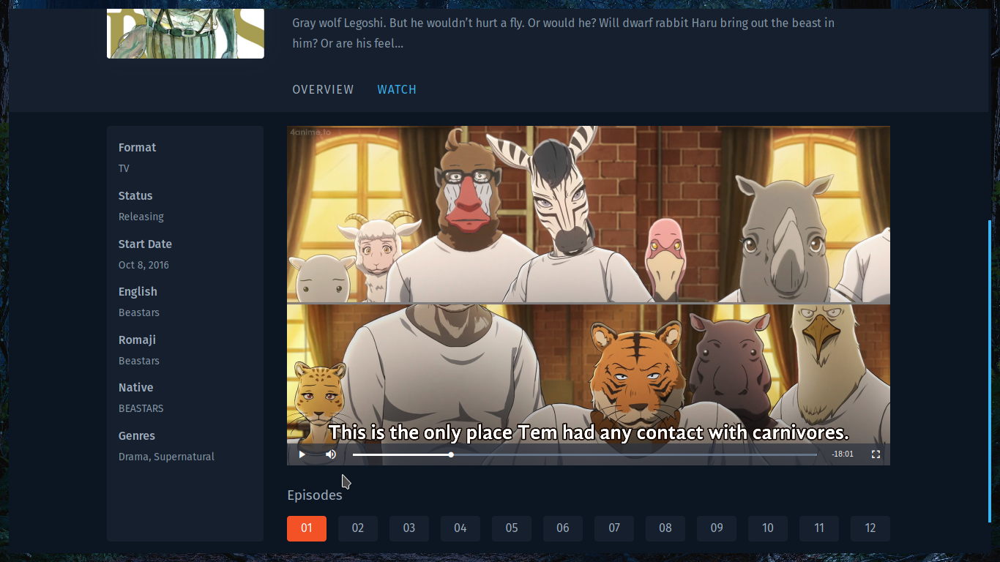
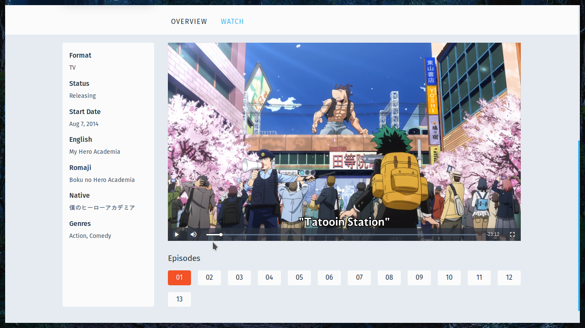
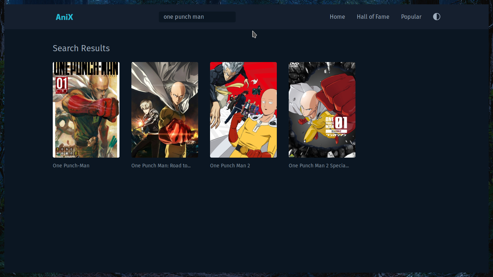
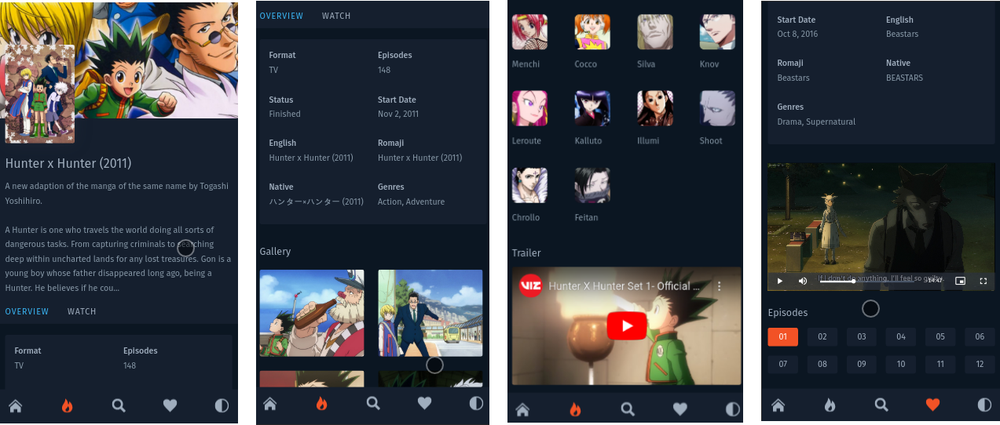

# AniX - Stream Animes



AniX is an anime streaming platform which allows you to watch animes by scraping links from the internet. AniX is built with ReactJS + RTK (redux toolkit) on the frontend and the scraping part is handled by python using scrapy framework.

The scraped links are stored in firestore. The data about animes such as title, episodes, duration etc., is gathered using the Anilist GraphQL API.

**NOTE**: the UI of AniX is heavily inspired from [anilist](https://anilist.co/)

## Core Packages

| Package           | For                        |
| ----------------- | -------------------------- |
| Redux Toolkit     | State Management           |
| React Redux       | Redux bindings for ReactJS |
| Styled Components | Styling                    |
| React Router      | Routing                    |
| Firebase          | Firebase SDK               |
| Scrapy (python)   | Scraping                   |

## Features

1. Search animes
2. Get recent animes
3. Get top rated animes
4. Watch animes
5. Download them (right click the video and select 'Save As')
6. Dark / Light Theme
7. Watch trailer and access other interesting info (using Anilist API)

## Running Locally

1. To run AniX locally in your machine:

   - You need to setup a firebase project and also get your scraper hosted on heroku or scrapinghub.

2. At the root of this project, create a .env file and make sure to provide the values for the following .env variables.

```javascript
# python scraper hosted url
REACT_APP_SCRAPER=[x]

# firebase
REACT_APP_APIKEY=[x]
REACT_APP_AUTHDOMAIN=[x]
REACT_APP_DATABASEURL=[x]
REACT_APP_PROJECTID=[x]
REACT_APP_STORAGEBUCKET=[x]
REACT_APP_MESSAGINGSENDERID=[x]
REACT_APP_APPID=[x]
```

3. Then run <code>npm i && npm start</code> to see AniX in action.

## Watch the Demo

[](https://www.youtube.com/watch?v=1SRaXipnfgU "Anix Demo")

## UI

### Home





### Popular Animes



### Anime


### Anime Overview



### Player





### Search Results



## Mobile


